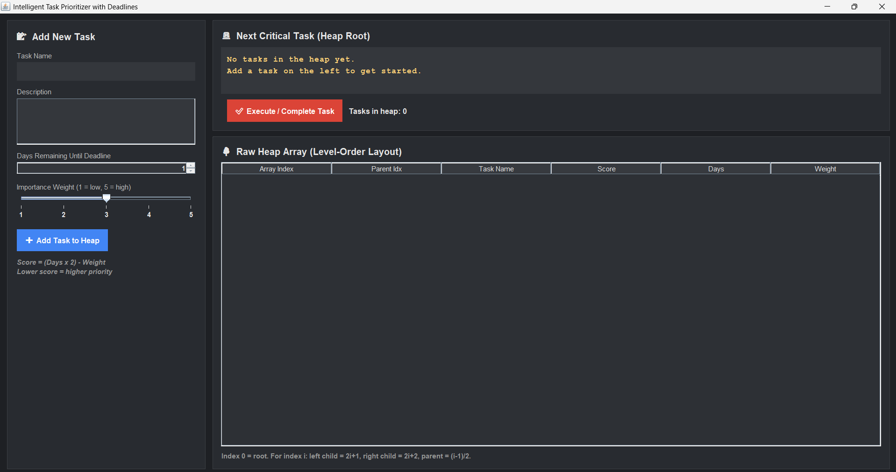

# Intelligent Task Prioritizer with Deadlines

A standalone Java desktop application developed as part of my **Java with DSA Summer Training Course**. This application acts as a productivity dashboard that mathematically tracks, prioritizes, and manages tasks dynamically using a **custom-built Binary Min-Heap data structure**.

## 🚀 Key Features
* **Custom DSA Engine:** Replaces standard collection utilities with a from-scratch Binary Min-Heap for maximum efficiency.
* **Mathematical Priority Scoring:** Priorities are calculated dynamically using the formula:  
  `Score = (Days Remaining * 2) - Importance Weight` (Lower scores indicate higher priority).
* **Live Heap Level-Order Table:** Displays the raw array representation of the underlying binary tree layout to visualize memory adjustments in real-time.
* **Modern Standalone Desktop UI:** Dark-themed GUI built purely using native Java Swing.

## 🛠️ Tech Stack & Architecture
* **Language:** Java (Core Java & Object-Oriented Programming)
* **GUI Framework:** Java Swing
* **Core Data Structure:** Custom Binary Min-Heap (Array-backed ArrayList structure)
* **Time Complexities:** 
  * Insert Task: $O(\log N)$
  * Extract Highest Priority Task: $O(\log N)$
  * Peek Root Task: $O(1)$

## 💻 UI Preview


## 🏃 How to Run the Application
1. Download or clone this repository.
2. Ensure you have the Java Development Kit (JDK) installed.
3. Open your terminal or IDE in the root folder and run:
   ```bash
   javac MainDashboard.java
   java MainDashboard
